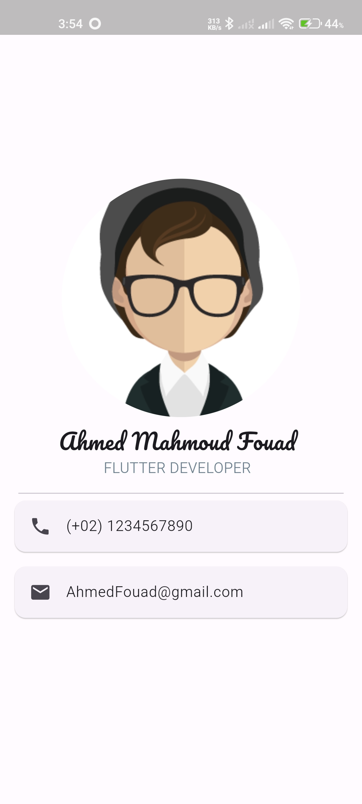

# Business Card App

This is my first Flutter project—a simple mobile application that displays my business card with personal information.

## Features

- Displays a business card with:
  - Full name
  - Job title
  - Contact information (phone number, email)
  - Social media links (LinkedIn, GitHub, etc.)
  - Profile picture

## Screenshot

<!-- Add a screenshot of your app here when available -->


## Installation

To run this project locally:

1. **Clone the repository:**

   ```bash
   git clone https://github.com/AhmedFouadRM/My-Business-Card.git
